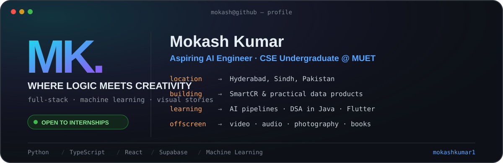

<picture>
  <source media="(prefers-color-scheme: dark)" srcset="./assets/profile-dark.svg">
  <source media="(prefers-color-scheme: light)" srcset="./assets/profile-light.svg">
  
</picture>

[About](#about-me) • [Projects](#featured-projects) • [Tech](#tech-stack) • [Experience](#experience-highlights) • [Beyond Code](#beyond-code) • [Connect](#lets-connect)

---

## About Me

> I build practical software at the intersection of full-stack engineering, machine learning, and real-world data—then bring a visual storyteller's eye to how it feels.

- 🔨 **Building:** SmartCR and scalable, data-driven web applications.
- 🌱 **Learning:** Neural models, automation pipelines, advanced DSA in Java, and Flutter.
- 🎯 **Looking for:** Full-stack engineering internships where I can ship useful products.
- 🎓 **Studying:** Computer Systems Engineering at Mehran University of Engineering and Technology.
- ⚡ **Away from code:** Directing shoots, editing audio, scripting reels, and reading about creativity.

---

## Tech Stack

**Programming Languages**

**Frontend & Mobile**

**Backend, Databases & State**

**Data Science, Analytics & Tools**

---

## Featured Projects

| Project | What it does | Tech | Links |
|---|---|---|---|
| **[SmartCR](https://github.com/mokashkumar1/SmartCR)** Latest active project | Full-stack attendance manager with flexible student imports, low-attendance insights, backups, and PDF/PNG/CSV exports. | `React 18` `Tailwind CSS` `Zustand` `Supabase` | **[Live demo ↗](https://smartcr.vercel.app/)** |
| **[University Results Portal — Open Source](https://github.com/mokashkumar1/muet-results-portal-opensource)** | Configurable GPA search and batch-ranking portal with serverless admin tools, Gemini OCR, GitHub-backed CSV storage, and static SEO generation. | `JavaScript` `Node.js` `Gemini API` `Vercel` | Open source |
| **[Personal Portfolio](https://github.com/mokashkumar1/portfolio)** | Dark, motion-rich portfolio presenting projects, experience, skills, and creative work through a responsive interface. | `Next.js 14` `TypeScript` `Tailwind CSS` `Framer Motion` | **[Live demo ↗](https://mokashkumar.vercel.app/)** |
| **[Amanat](https://github.com/mokashkumar1/amanat)** | Transparency-first donation platform with direct payments, proof submission, organizer verification, and a public donation ledger. | `HTML5` `CSS3` `JavaScript` `Supabase` | Source |
| **[Online Voting System](https://github.com/mokashkumar1/onlinevotingsystem)** | PHP election application with voter and admin workflows, candidate management, results, audit views, session handling, and CSRF protection. | `PHP` `MySQL` `HTML5` `CSS3` | Source |
| **[Rickshaw Fare Predictor](https://github.com/mokashkumar1/rickshaw-fare-predictor)** | Interactive fare estimator backed by linear regression implemented from scratch with gradient descent. | `Python` `NumPy` `Pandas` `HTML5` | **[Live demo ↗](https://rickshaw-fare-predictor.vercel.app/)** |

---

## GitHub Stats

---

## Experience Highlights

- **Volunteer · 1st International Conference on Innovations in Information and Communication Technologies (IICT’26)** — Jan 2026 · Jamshoro, Sindh, Pakistan
- **Volunteer · PEF Soft Skills Training Program** — Mar 2025 · MUET, Jamshoro
- **Head Director of Videography · Hult Prize MUET SZAB** — Jan 2025 – Mar 2025 · Jamshoro, Sindh, Pakistan
- **Content Creator · D3 Digital Dream Dynamo** — Oct 2024 – Jan 2025 · Jamshoro, Sindh, Pakistan
- **Video & Audio Editor · MUET FM 92.6** — Aug 2024 – Jan 2025 · Jamshoro, Sindh, Pakistan

---

## Beyond Code

| 🎬 Visual Storytelling | 🎧 Audio & Video | 📚 On My Reading List | 💡 Side Curiosity |
|---|---|---|---|
| Photography, videography, and meaningful visual stories | Reels, scripts, sound mixing, podcasts, and MUET FM 92.6 | *The Art of Not Overthinking* and *Steal Like an Artist* | Neural models, automation pipelines, and advanced DSA |

---

## Let's Connect

