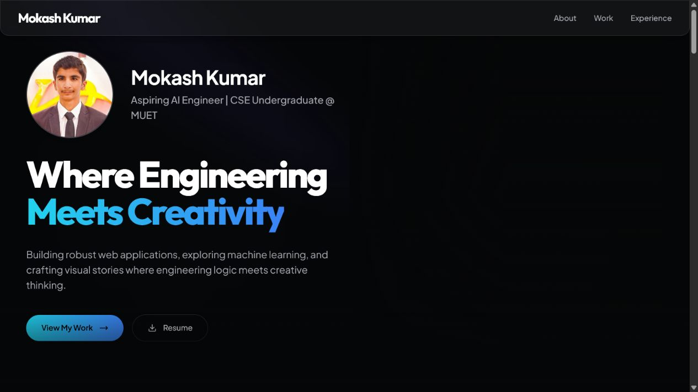

<h1 align="center">Mokash Kumar</h1>

  <strong>Aspiring AI Engineer and Computer Systems Engineering undergraduate building where engineering meets creativity.</strong>

  <a href="https://mokashkumar.vercel.app">Portfolio</a> •
  <a href="#about-me">About</a> •
  <a href="#featured-projects">Projects</a> •
  <a href="#tech-stack">Tech Stack</a> •
  <a href="#experience">Experience</a> •
  <a href="#connect">Connect</a>

---

  

---

## About Me

- **Computer Systems Engineering undergraduate** at Mehran University of Engineering and Technology (MUET)
- **Based in** Hyderabad, Sindh, Pakistan
- **Focused on** full-stack development, machine learning, and practical data-driven products
- **Currently building** SmartCR and exploring neural models, automation pipelines, Java DSA, and Flutter
- **Open to** full-stack engineering internships and opportunities to ship useful software

## Featured Projects

- **[SmartCR](https://github.com/mokashkumar1/SmartCR)** — Full-stack attendance manager with flexible student imports, low-attendance insights, backups, and PDF, PNG, and CSV exports. **[Live Demo](https://smartcr.vercel.app/)**
- **[University Results Portal](https://github.com/mokashkumar1/muet-results-portal-opensource)** — Configurable GPA search and batch-ranking portal with serverless admin tools, Gemini OCR, GitHub-backed CSV storage, and static SEO generation.
- **[Personal Portfolio](https://github.com/mokashkumar1/portfolio)** — Responsive portfolio for projects, experience, skills, and creative work, built with Next.js, TypeScript, and Framer Motion. **[Live Demo](https://mokashkumar.vercel.app/)**
- **[Amanat](https://github.com/mokashkumar1/amanat)** — Transparency-first donation platform with direct payments, proof submission, organizer verification, and a public donation ledger.
- **[Online Voting System](https://github.com/mokashkumar1/onlinevotingsystem)** — PHP election application with voter and admin workflows, candidate management, results, audit views, and CSRF protection.
- **[Rickshaw Fare Predictor](https://github.com/mokashkumar1/rickshaw-fare-predictor)** — Interactive fare estimator backed by linear regression implemented from scratch with gradient descent. **[Live Demo](https://rickshaw-fare-predictor.vercel.app/)**

## Tech Stack

- **Languages:** Python, JavaScript, TypeScript, Java, C++, PHP, SQL, Dart
- **Frontend:** React 18, Next.js, Tailwind CSS, HTML5, CSS3, Flutter
- **Backend & Databases:** Node.js, REST APIs, Supabase, PostgreSQL, MySQL
- **Data Science & ML:** NumPy, Pandas, Scikit-learn, linear regression, gradient descent, data cleaning, data visualization
- **State Management:** Zustand, React Hooks, Context API
- **Tools:** Git, GitHub, Vercel, VS Code, Figma, Tableau, Microsoft Excel

## Experience

- **Volunteer — IICT’26** · Jan 2026 · Jamshoro, Sindh
- **Volunteer — PEF Soft Skills Training Program** · Mar 2025 · MUET, Jamshoro
- **Head Director of Videography — Hult Prize MUET SZAB** · Jan 2025 – Mar 2025
- **Content Creator — D3 Digital Dream Dynamo** · Oct 2024 – Jan 2025
- **Video & Audio Editor — MUET FM 92.6** · Aug 2024 – Jan 2025

## Beyond Code

- **Visual storytelling** — Photography, videography, and content creation
- **Audio and video** — Reels, scripts, sound mixing, podcast editing, and university-radio production
- **Reading** — *The Art of Not Overthinking* and *Steal Like an Artist*
- **Side interests** — Neural models, automation pipelines, and advanced data structures and algorithms

## GitHub Stats

  
  

  

## Connect

  <a href="mailto:mokshkumar38@gmail.com">Email</a> •
  <a href="https://github.com/mokashkumar1">GitHub</a> •
  <a href="https://linkedin.com/in/mokashkumar">LinkedIn</a> •
  <a href="https://instagram.com/mokshluhana">Instagram</a> •
  <a href="https://drive.google.com/file/d/1QwVP4oj3UiYuiX0XP-XkFIAgWKsUrPcH/view?usp=sharing">Resume</a>

  

---

  Building practical software and telling meaningful stories.

