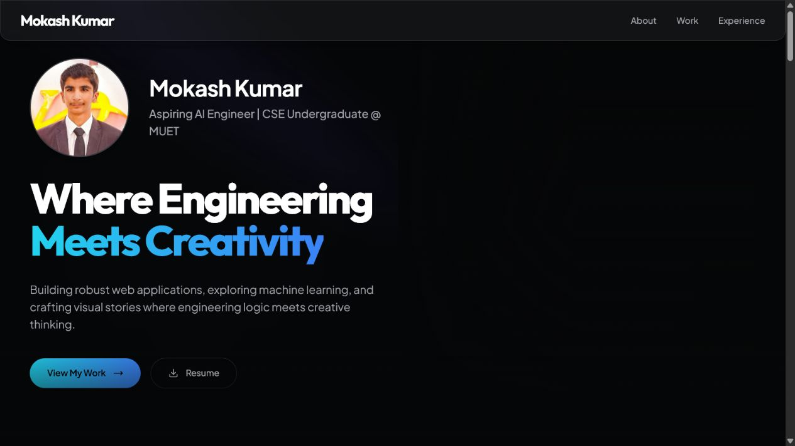

<h1 align="center">Hi, I'm Mokash Kumar</h1>

<h3 align="center">Computer Systems Engineering student building full-stack and applied AI products</h3>

  
  
  

  

## About

I'm a **Computer Systems Engineering** student at Mehran University of Engineering and Technology (MUET), focused on software development and applied AI. I enjoy turning real problems into useful products—from academic platforms and workflow tools to structured LLM applications and Windows utilities.

My current interests include **backend development, full-stack applications, machine learning, LLM-powered products, performance benchmarking, and practical automation**.

## Selected Work

| Project | What it does | Stack |
| --- | --- | --- |
| **[MUET Results Portal](https://github.com/mokashkumar1/muet-results-portal-opensource)** | Academic-results platform with GPA lookup, semester history, dense rankings, and an authenticated coordinator workflow. **[Live demo](https://muetresults.vercel.app/)** | JavaScript, Node.js, Vercel Functions, Zod |
| **[SmartCR](https://github.com/mokashkumar1/SmartCR)** | Attendance workflow for class representatives with roster imports, absence-first recording, subject history, and low-attendance calculations. **[Live demo](https://smartcr.vercel.app/)** | React, Zustand, Supabase, PostgreSQL |
| **[AI Resume Analyzer](https://github.com/mokashkumar1/resume-analyzer)** | Compares PDF or Word resumes with job descriptions, identifies skill gaps, and validates structured AI output before rendering results. **[Live demo](https://ai-resume-analyzer-y4ns.onrender.com/)** | Python, Flask, Pydantic, Groq API |
| **[SnapStitch](https://github.com/mokashkumar1/SnapStitch)** | Windows utility that captures and stitches code screenshots, with clipboard monitoring, deduplication, global hotkeys, and a floating HUD. **[Download](https://github.com/mokashkumar1/SnapStitch/releases/latest)** | Python, PyQt6, Pillow, Win32 API |

## Tools I Work With

  
  
  
  
  
  
  
  
  
  
  
  
  
  

## Research & Learning

- Compared classic sorting algorithms across CPU and NVIDIA GPU workloads using Java, Python, PyTorch, and CUDA.
- Exploring machine learning, natural language processing, parallel computing, algorithm analysis, and data-driven systems.
- Strengthening software-engineering fundamentals through testable modules, input validation, structured outputs, and real deployments.

## Beyond Code

Video, photography, audio editing, volunteering, and event leadership have helped me become a clearer communicator and a more thoughtful teammate—skills I bring into every technical project.

---

  <strong>Have an internship, collaboration, or interesting problem in mind?</strong> 
  <a href="https://linkedin.com/in/mokashkumar">Let's connect on LinkedIn</a> or <a href="mailto:mokashkumar24@gmail.com">send me an email</a>.

